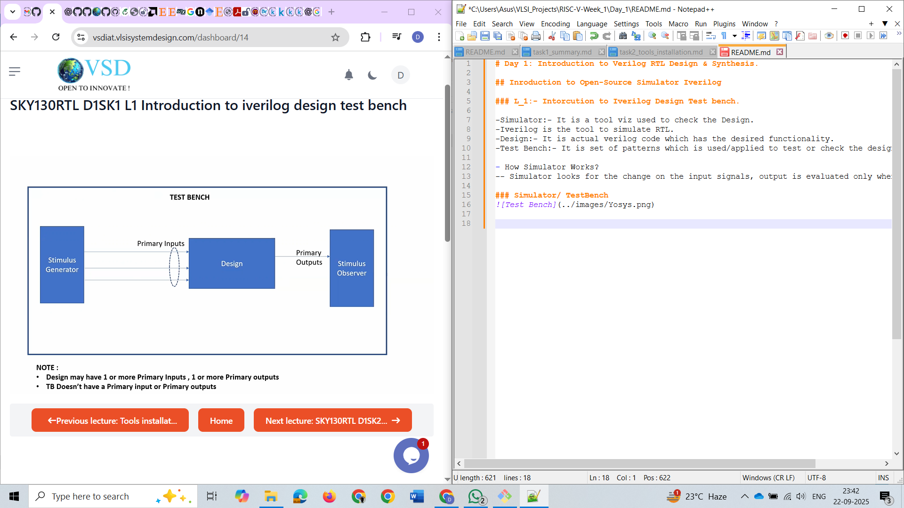
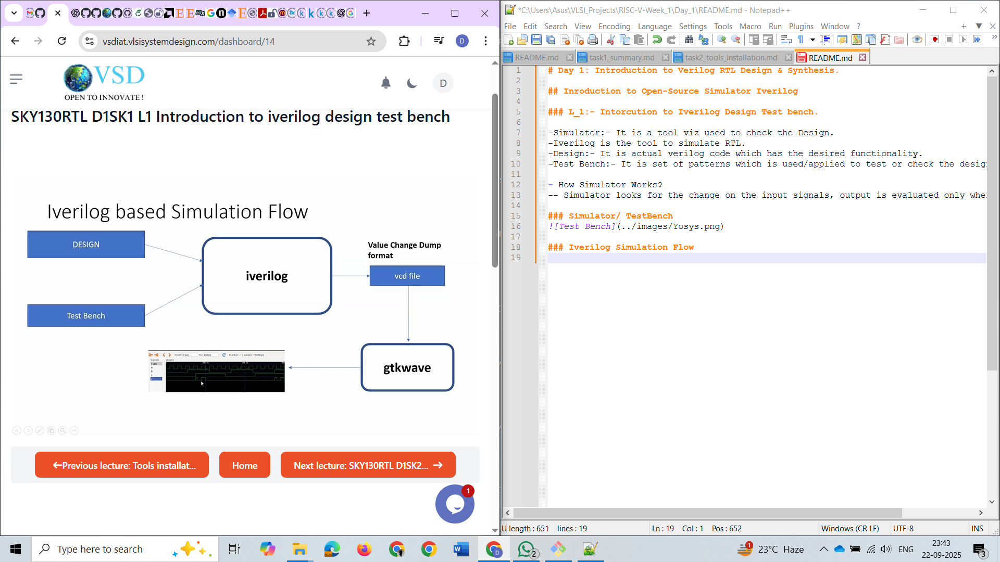
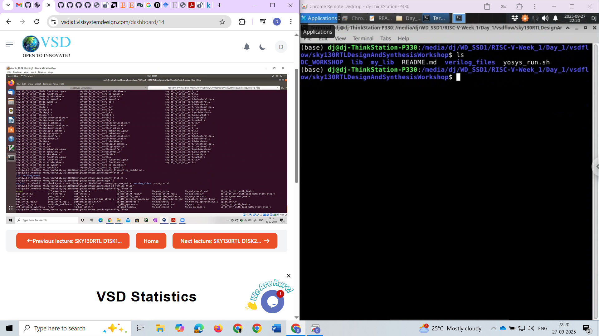
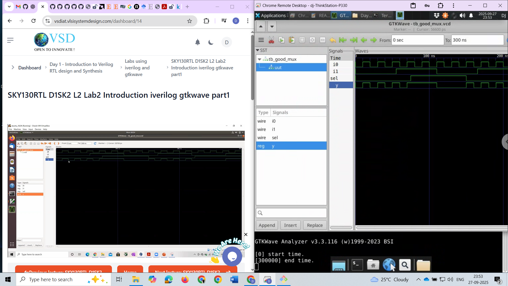

# Day 1: Introduction to Verilog RTL Design & Synthesis.

## Inroduction to Open-Source Simulator Iverilog

### L_1:- Introduction to Iverilog Design Test bench.

- Simulator:- It is a tool viz used to check the Design.
- Iverilog is the tool to simulate RTL.
- Design:- It is actual verilog code which has the desired functionality.
- Test Bench:- It is set of patterns which is used/applied to test or check the design.

- How Simulator Works?
-- Simulator looks for the change on the input signals, output is evaluated only when input changes.

### Simulator/ TestBench

### Iverilog Simulation Flow

## Labs Using Iverilog and GTKWave

### L_1:- Lab1 Introduction to Lab1
-cloned the https://github.communalg123sky130RTLDesignAndSynthesisWorkshop repository, and got overview of the contents of folder. 
-This has standard cell library, verilog files, and test bench files.
### Folder Overview

### L_2:- Lab2 Introduction iverilog gtkwave p1
- Verilog files folder:- Here for every verilog design file we have test bench for that name start  from tb.
-Loaded the good mux verilog file and test bench file, learnt how to use gtk wave and iverilog.
### Snapshot of mux waveform

### L_3:- Lab2 Introduction iverilog gtkwave p2
